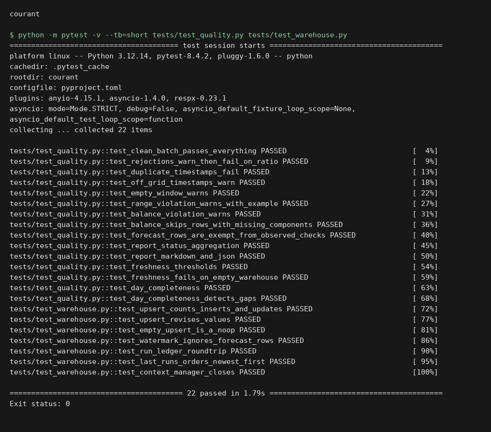
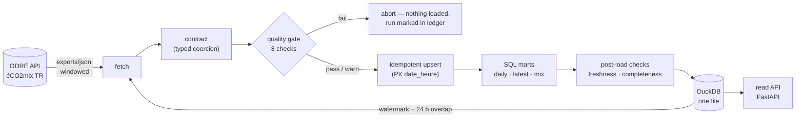

# courant

> *courant* — French for both "electric current" and "up-to-date".
> An open-data pipeline that is exactly that: current data, kept current.

[](https://github.com/Vincent-P-essy/courant/actions/workflows/ci.yml)
[](https://github.com/Vincent-P-essy/courant/actions/workflows/pipeline.yml)
[](pyproject.toml)
[](pyproject.toml)
[](LICENSE)

**courant** ingests [éCO2mix](https://odre.opendatasoft.com/explore/dataset/eco2mix-national-tr/) —
the quarter-hourly open dataset of the French electricity grid (consumption,
production mix, CO2 intensity) — into a single-file DuckDB warehouse, behind a
data contract you can read and a quality gate you can trust. GitHub Actions is
the scheduler; the whole pipeline state travels in one file.

Most "open data pipeline" projects load a CSV into pandas and call it a day.
This one is shaped like production: **incremental ingestion with
late-revision handling, a typed contract with physical sanity checks, an
idempotent warehouse, versioned SQL transforms, a run ledger, a freshness
SLO, and a read API** — each with tests.

## Execution preview



Local execution of `python -m pytest -v --tb=short tests/test_quality.py tests/test_warehouse.py`. The input and output shown come from the repository example or test fixtures. [Verification](docs/verification.md).

## How it works



Three domain facts shape the design, all discovered against the live API and
encoded in [the contract](src/courant/schema.py):

- **Rows exist ahead of now.** The dataset publishes forecast rows ~36 h into
  the future; a row is *observed* once `consommation` is non-null. Quality
  checks and marts operate on the observed subset; forecasts are stored as-is.
- **Recent rows get revised.** Every run re-fetches a 24 h overlap behind the
  watermark and upserts by primary key, so upstream corrections converge
  instead of duplicating.
- **The grid must balance.** Consumption ≈ Σ production + net exchanges +
  storage flows (pumping and battery charging are negative by convention).
  The pipeline checks this equation on every observed row.

## The quality gate

| check | severity | what it protects |
|---|---|---|
| `contract_coercion` | fail > 5 % rejected, warn otherwise | schema drift, type garbage |
| `primary_key_unique` | fail | duplicate quarter-hours |
| `window_not_empty` | warn | silent upstream outages |
| `quarter_hour_grid` | warn | timestamps off the 15-min grid |
| `plausible_ranges` | warn | values outside physical envelopes (e.g. consumption 20–110 GW) |
| `grid_balance` | warn | rows where the balance equation drifts > ±5 % |
| `freshness` | warn > 6 h, fail > 48 h | stale data serving as fresh |
| `day_completeness` | warn | gaps in the last finished day (96 quarters; DST days 92/100) |

A `fail` **before** the load aborts the run — bad batches never reach the
warehouse. This is a real report from a real run against the live API:

```
## Data quality — ✅ PASS

| check | result | detail |
|---|---|---|
| contract_coercion   | ok | 0/410 record(s) rejected |
| window_not_empty    | ok | 410 record(s) fetched |
| primary_key_unique  | ok | 0 duplicated timestamp(s) |
| quarter_hour_grid   | ok | 0 timestamp(s) off the quarter-hour grid |
| plausible_ranges    | ok | 0 value(s) outside plausible bounds |
| grid_balance        | ok | 287 row(s) checked, 0 beyond ±5% (worst 2.1%) |
| freshness           | ok | last observed quarter-hour 2026-07-14 17:00 UTC (0.3 h ago) |
| day_completeness    | ok | 2026-07-13: 96 observed quarter-hour(s) |
```

## Quickstart

```sh
pip install git+https://github.com/Vincent-P-essy/courant

courant run          # fetch → validate → load → transform (≈5 s, no auth)
courant status       # run ledger + freshness
courant serve        # read API on :8000
```

```sh
curl -s localhost:8000/health | jq
# {"status": "ok", "last_observed": "2026-07-14T17:00:00Z", "lag_hours": 0.3, ...}

curl -s "localhost:8000/daily?days=3" | jq '.[] | {day, avg_consumption_mw, renewable_share_pct, avg_co2_g_kwh}'
# {"day": "2026-07-12", "avg_consumption_mw": 42528, "renewable_share_pct": 32.8, "avg_co2_g_kwh": 21.6}
# ...

curl -s localhost:8000/mix | jq '.[0]'
# {"source": "nuclear", "mwh": 2584960, "share_pct": 63.8}
```

Useful flags: `courant run --since 2026-06-01T00:00:00Z` (backfill),
`--report out.md` (Markdown quality report), `--json`, `--strict` (exit 1 on
warnings — for CI gating). Endpoints: `/health`, `/latest`, `/daily`, `/mix`,
`/runs`, plus OpenAPI docs at `/docs`.

## Scheduling and storage: the deliberate part

This pipeline runs **without Airflow, dbt, pandas, or a database server**, and
the README owes you the why:

- **GitHub Actions cron is the scheduler.** One incremental cycle every two
  hours ([pipeline.yml](.github/workflows/pipeline.yml)): the warehouse file
  is restored from the Actions cache, updated, saved back, and uploaded as an
  artifact; the quality report lands in the job summary. Orchestration needs
  here are one linear job with retries — a DAG engine would be pure overhead.
  The workflow file documents where that stops being true.
- **DuckDB is the warehouse *and* the transform engine.** Marts are plain
  `.sql` files executed in filename order, rebuilt from raw on every run
  (`CREATE OR REPLACE`) — versioned like code, reviewed like code, incapable
  of drifting from their definitions. At this scale dbt would add a framework
  around three SQL files.
- **State is one file.** Cache-evicted? The next run re-bootstraps its window
  and the upsert converges. Want the data? Download the artifact and
  `duckdb courant.duckdb` — the ledger and marts are all there.
- **No pandas.** Coercion is typed Python at the boundary; everything
  analytical is SQL. There is no dataframe soup in the middle.

Trade-offs owned: DuckDB is single-writer (the API opens read-only,
per-request connections); the Actions cache holds ~7 days of eviction risk
(mitigated by re-bootstrap); a 2-hour cron gives at most ~2.5 h of staleness
against a 6 h warn / 48 h fail SLO.

## Observability

- **Run ledger in the warehouse** (`/runs`, `courant status`): window, rows
  fetched/rejected/inserted/updated, quality status, error — every run,
  including the failed ones.
- **Quality report** per run: terminal, Markdown (`--report`), JSON in the
  ledger, and the GitHub job summary.
- **Freshness as an SLO**: `/health` answers 503 when the data is stale, so
  anything monitoring the API inherits the data's health, not just the
  process's.

## Tests

79 offline tests (~1 s): the contract against **live-captured fixtures**
(including a real record that closes the balance equation to 0.004 %), every
quality check tripped on crafted data, upsert idempotence, hand-checked mart
math (including the Paris-midnight day split), respx-mocked source retries,
pipeline end-to-end with a scripted source, API and CLI. `mypy --strict`,
ruff, coverage gate in CI on 3.11–3.13.

```sh
uv sync && uv run pytest -q
```

## Limits

- Bounds in the contract are France-envelope specific; pointing courant at
  another éCO2mix perimeter means revisiting them.
- The upstream dataset is *temps réel* and consolidated later; this pipeline
  tracks the TR view (the overlap absorbs revisions, it doesn't reconcile
  against the consolidated dataset).
- `day_completeness` accepts 92/100 quarters on any day, not only actual DST
  transition dates — a deliberate simplification, noted here rather than
  hidden.

## License

[MIT](LICENSE) — © Vincent Plessy
